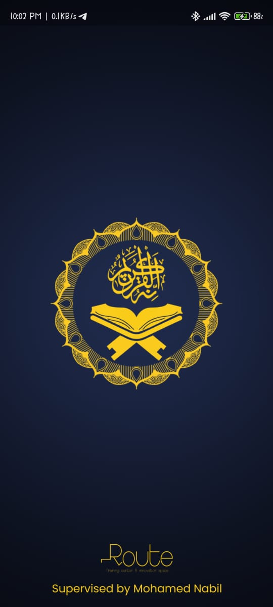
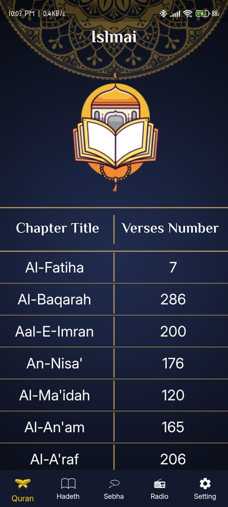
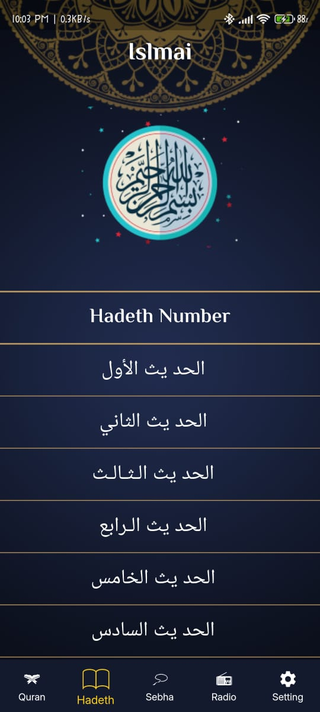
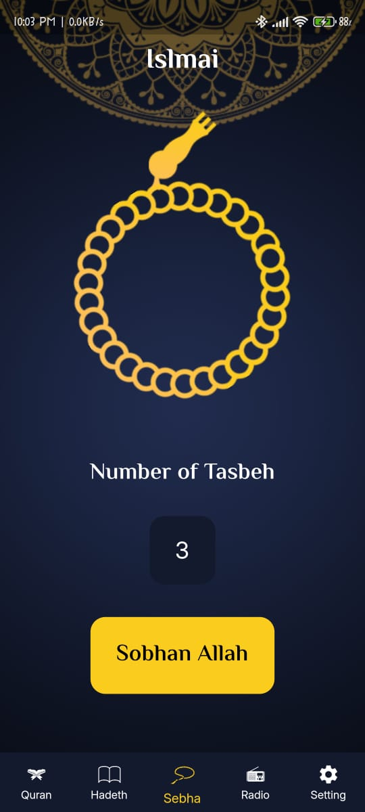
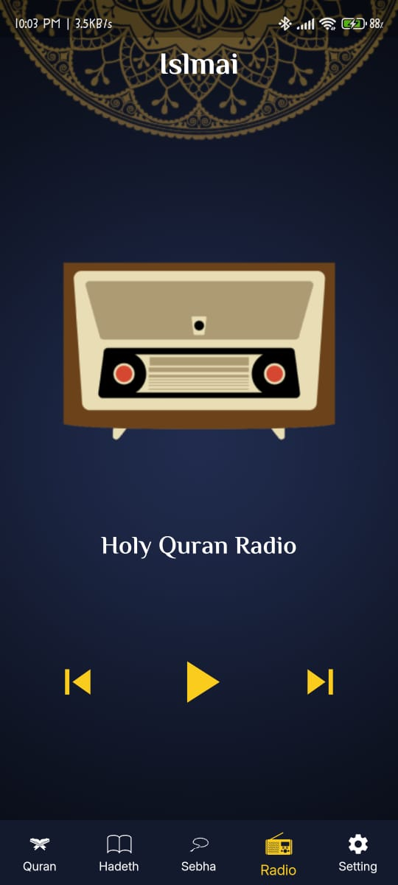
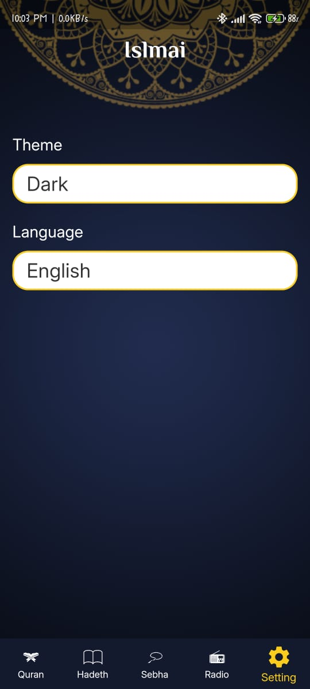

# 🕌 Islami - Flutter Islamic Companion App

<div align="center">
  
</div>

## 🔍 Overview

Islami is a Flutter application that helps users explore Islamic content with a clean experience:
- Read Quran surahs and verses from bundled assets
- Browse curated Hadith entries
- Use a Tasbeeh counter with smooth visuals
- Toggle app Theme (Light/Dark) and Language (English/Arabic)

All content is available offline. The app supports localization (en/ar) and remembers your theme/language preferences.

## ✨ Features

- 📖 Quran
  - Full surah list with Arabic and English names
  - Verse reader (from `Assets/Quran-Suras/<index>.txt`)
- 📜 Hadith
  - Hadith list parsed from `Assets/Hadeth/ahadeth.txt`
  - Detail screen for full hadith text
- 📿 Tasbeeh (Sebha)
  - Tap to increment with rotating Rosary animation
  - Cycles through common adhkar phrases
- 📻 Radio
  - Simple UI (placeholder controls)
- 🎛️ Settings
  - Light/Dark theme switch
  - English/Arabic language switch
  - Preferences are persisted using SharedPreferences
- 🌍 Localization
  - ARB-based with generated localizations (via `flutter_gen`)
- 🎨 Theming & Typography
  - Custom themes and fonts (ElMessiri, Inter)

## 🏗️ Architecture

Feature-oriented structure using Provider for state and simple separation of concerns.

```
lib/
├── UI/
│   ├── Home/
│   │   ├── Quran/            # Surah list, details, verse widgets
│   │   ├── Hadeth/           # Hadith list + details
│   │   ├── Sebha/            # Tasbeeh counter
│   │   ├── Radio/            # Radio placeholder UI
│   │   └── Settings/         # Language & Theme bottom sheets
│   ├── Providers/            # ThemeProvider, LocaleProvider
│   ├── Theme/                # App light/dark themes
│   ├── Splash Screen/        # Splash screen
│   └── defult_scaffold.dart  # Shared scaffold wrapper
├── l10n/                     # app_en.arb, app_ar.arb
├── ui_utils.dart             # Helpers (translation accessor)
└── main.dart                 # App entry
```

### Patterns Used
- Provider (ChangeNotifier) for theme and locale
- SharedPreferences for lightweight persistence
- Generated l10n (ARB files) for localization

## 🛠️ Technologies & Packages

- flutter_localizations + intl (i18n)
- provider (^6.1.2) – state management
- shared_preferences (^2.2.3) – persistence
- cupertino_icons – iOS icons
- flutter_native_splash – native splash setup

Fonts
- ElMessiri (Bold, SemiBold)
- Inter (Regular)

## 🚀 Getting Started

### Install dependencies

```bat
flutter pub get
```

### Run the app (choose a device/emulator first)

```bat
flutter run
```

## 🧱 Build for Production

Android APK:
```bat
flutter build apk --release
```

Android App Bundle (Play Store):
```bat
flutter build appbundle --release
```

iOS (on macOS):
```bat
flutter build ios --release
```

Web:
```bat
flutter build web --release
```

## 📸 Screenshots

<p style="text-align:center;">
  
  
  
  
    

</p>


## 🔧 Configuration

### Localization (en/ar)
- ARB files live in `lib/l10n/` (e.g., `app_en.arb`, `app_ar.arb`)
- Config is controlled by `l10n.yaml`
- To update generated code after changing ARB files:

```bat
flutter gen-l10n
```

### Assets
Ensure these paths remain in `pubspec.yaml`:
- `Assets/Images/`
- `Assets/Quran-Suras/`
- `Assets/Hadeth/`

### Custom Fonts
Defined in `pubspec.yaml`:
- ElMessiri (Bold, SemiBold)
- Inter (Regular)

### Native Splash Screen
Configured via `flutter_native_splash.yaml`. To regenerate the native splash:

```bat
flutter pub run flutter_native_splash:create
```

Note: The app also shows an in-app splash image before navigating to Home.

## 📂 Project Structure

```
islami/
├── android/              # Android platform files
├── ios/                  # iOS platform files
├── linux/ macos/ web/    # Desktop/Web (optional platforms)
├── lib/                  # Main application code
│   ├── UI/               # Features and UI
│   ├── l10n/             # Localizations
│   └── main.dart         # Entry point
├── Assets/               # App assets (images, Quran, Hadith)
├── test/                 # Tests
└── pubspec.yaml          # Dependencies & configuration
```

## 🤝 Contributing

Contributions are welcome!
1. Fork the repository
2. Create a feature branch: `git checkout -b feature/your-feature`
3. Commit: `git commit -m "feat: add your feature"`
4. Push: `git push origin feature/your-feature`
5. Open a Pull Request

### Code Style
- Follow Effective Dart style
- Prefer meaningful names and small widgets
- Add comments for non-obvious logic

## 🐛 Bug Reports

Please open an issue with:
- Description
- Steps to reproduce
- Expected vs actual behavior
- Screenshots (if applicable)
- Device/platform info

## 📈 Notes on Performance

- All content is local; no network latency in core features
- Image assets are optimized via Flutter’s asset system
- Efficient state updates (Provider + ChangeNotifier)

## 🙏 Acknowledgments

- Flutter team and community
- Islamic resources for Quran and Hadith texts packaged as assets

---

<div style="text-align:center;">
  Made with ❤️ using Flutter
  
  ⭐ Star this repository if you found it helpful!
</div>
